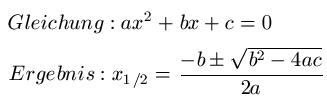

# Beispiel-Code zum Lösen von quadratischen Gleichungen

## Lösungsformel aka *Mitternachtsformel*




### Voraussetzungen

Java 8 muss auf dem Rechner installiert sein.

### Baue und starte das Programm

#### Unter Linux, Unix oder Mac

Öffne ein Terminal im Verzeichnis der Applikation und gib folgendes ein:

```bash
./gradlew build
./start.sh
```

#### Unter Windows

Öffne ein Command-Fenster im Verzeichnis der Applikation und gib folgendes ein:

```bash
./gradlew.bat build
./start.bat
```
